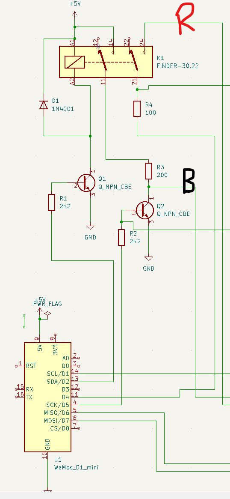

# Fork from Bob's repro.
Works for e-coder and arb meters and should work for proread meters.
This is now a module to read data from the neptune e-coder, the rest is up to you. 

Assumption : the e-coder and arb meters assume that you are communicating over 5v (clock). as such the code is desigend to us a transistor as a switch and the clock signals are inverted because of this. 

## Configuration
```
NeptuneProtocol meter1(clock_pin, read_pin, relay_pin, pullup);
```
- clock_pin : Pin that is connected to clock (black)
- read_pin : Pin connected to xmit on the neptune reader (Red)
- Relay_pin : Pin to enable the relay.
 pullup is regarding to enable (true) or disable (false) the interal pullup resister on the device.
## data structure
```
NeptuneProtocol::reading reading;
```
- serialNum : serial number returned by the meter
- readVal   : what the meter returns either 6 or 8 digits depending on your type of meter.
- swver     : software version on the meter typically SW200
- unknown1  : exactly that.
- unknown2  : exactly that
- unknown3  : exactly that

 The unknowns are related to checksums as well as leak or reverse flow. NDA blocked documentation requried.

## Functions
```
 setup()
```
- INPUT : nothing
- OUTPUT: nothing
  
  This simply 'sets up things. only need to call once.

 ```
 readMeter(&struct)
```
-  INPUT : struct that will used (pass by reference)
- OUTPUT: nothing (well struct passed in will be updated)
  
  This function will enable relay, power up the meter, perform a reading and disable relay.
  
# Example
```
Example useage on a esp32 D1 mini
#include <NeptuneProtocol.h>
int meter1_clock_pin = D5; // black
int meter1_read_pin  = D4; // red
int meter1_relay_pin = D1;
bool pullup = true;

NeptuneProtocol meter1(meter1_clock_pin, meter1_read_pin, meter1_relay_pin, pullup);
NeptuneProtocol::reading meter1reading;
    
void setup() {
  Serial.begin(115200);
  meter1.setup();
}

void loop() { 
  meter1reading = {}; // Clear struct
  delay(500);
  meter1.readMeter(&meter1reading);
  Serial.println("Meter 1");
  Serial.print(" Serial Number : ");Serial.println(meter1reading.serialNum);
  Serial.print(" Reading Value : ");Serial.println(meter1reading.readVal);
  Serial.print(" Software Ver  : ");Serial.println(meter1reading.swver);
  Serial.print(" Unknown 1     : ");Serial.println(meter1reading.unknown1);
  Serial.print(" Unknown 2     : ");Serial.println(meter1reading.unknown2);
  Serial.print(" Unknown 3     : ");Serial.println(meter1reading.unknown3);
     
  for (int i = 10;i>0;i--) {
    Serial.print(i);
    Serial.print(".");
    delay(1000);
  }
  Serial.println("");
}
```
## Circuit diagram
NOTE: this is snipped from a design that reads two meters via the same pins through two different relays. B == black wire, R == red wire.

